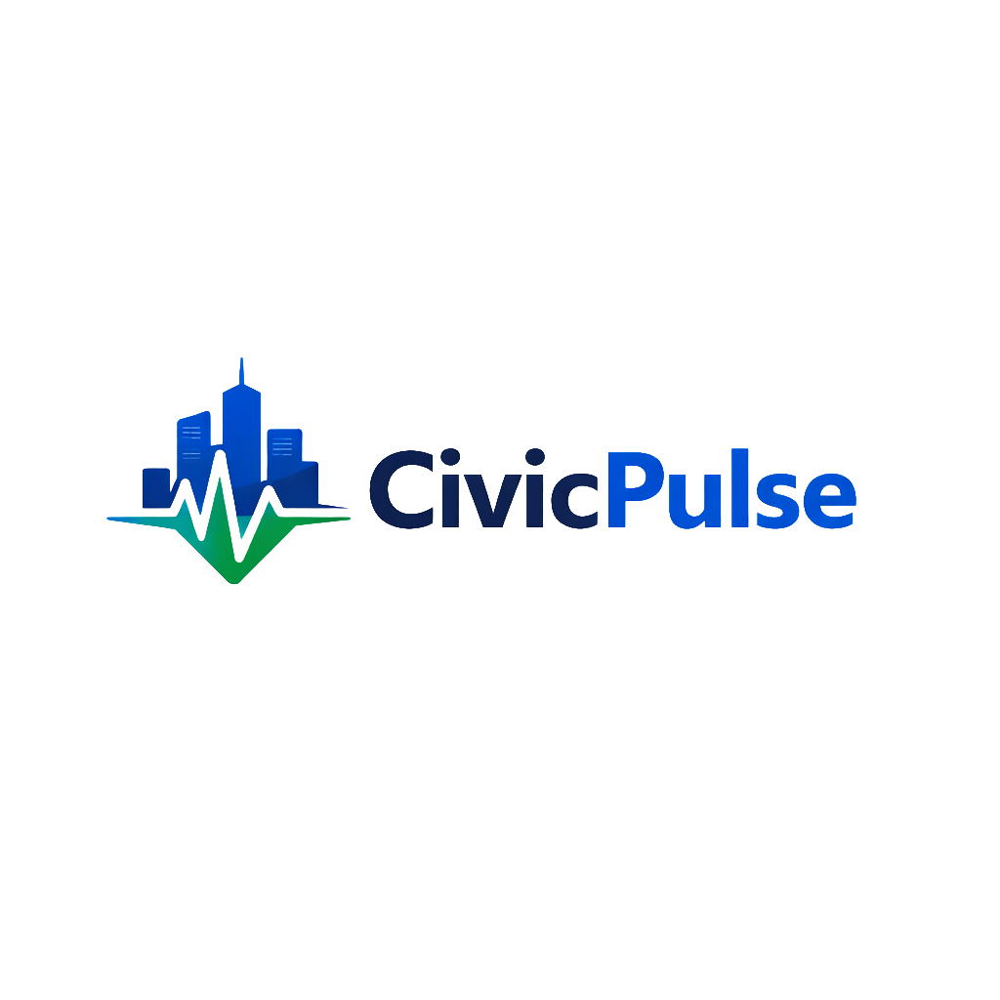

<div align="center">



# CivicPulse

**Innovating Safety, Empowering Responders.**

A next-generation emergency response and citizen safety platform connecting **citizens in distress**, **field responders**, and **command-center dispatchers** in real time — powered by Firebase and Google Gemini AI.

[](https://flutter.dev)
[](https://firebase.google.com)
[](https://nodejs.org)
[](https://ai.google.dev)
[](#)
[](#license)

</div>

---

## What is CivicPulse?

When an emergency happens, every second counts. CivicPulse closes the gap between the moment someone needs help and the moment help arrives, by giving citizens a one-tap way to raise an alert, giving responders a live mission dashboard, and giving command centers full situational awareness — all synced in real time and backed by AI-driven triage.

The project ships as a **single Flutter codebase** targeting Android, iOS, Web, macOS, Linux, and Windows, paired with a **Node.js/Express backend** for AI processing and secondary data storage.

---

## Key Features

### 🆘 Citizen App
- **One-Tap SOS** — instantly captures GPS location and broadcasts a Priority-1 alert to nearby responders and the command center
- **Multimedia reporting** — attach photos and audio evidence, processed through Cloudinary for low-bandwidth accessibility
- **AI emergency assistant** — a Gemini-powered chatbot offering first-aid guidance while help is on the way
- **Live rescue tracking** — real-time map and ETA of the assigned responder
- **Incident history** — a personal log of past reports and their resolution

### 🚑 Responder Dashboard
- **Duty toggle** — mark yourself Active/Standby so only available units get pinged
- **Mission cards** — incoming alerts with type, severity, and AI reasoning, with accept/reject workflow
- **Turn-by-turn navigation** — built on `flutter_map` + OpenStreetMap
- **Live performance stats** — missions completed and rating, synced via Firestore
- **Background location sync** — keeps the fleet visible to command in real time

### 🖥️ Admin Command Center
- **Live incident feed** — every emergency in the system, streamed with zero-lag updates
- **Tactical map** — severity-based pulsing incident markers and live responder tracking
- **Manual & AI-assisted dispatch** — assign responders yourself or let the system suggest the best match
- **AI deep-dive** — confidence score, severity classification, and human-readable reasoning per incident
- **Audio evidence playback** and full **fleet management**

### 🤖 AI Core (Google Gemini)
- Automated incident classification (e.g. *Structural Fire* vs. *Medical Emergency*)
- Smart queue prioritization so critical incidents always surface first
- Guardrailed first-aid guidance for the citizen-facing chatbot

---

## Tech Stack

| Layer | Technology |
|---|---|
| **Frontend** | Flutter (Dart), Provider (state management) |
| **Maps & Location** | `flutter_map`, OpenStreetMap, `geolocator` |
| **Auth & Realtime Data** | Firebase Auth, Cloud Firestore |
| **Media** | Cloudinary (image & audio pipeline) |
| **AI** | Google Gemini 1.5 Flash (`@google/genai`) |
| **Backend** | Node.js, Express, MongoDB (Mongoose), Firebase Admin SDK |
| **Targets** | Android · iOS · Web · macOS · Linux · Windows |

---

## Project Structure

```
Hackathon_1/
├── lib/
│   ├── core/            # theme, shared utils
│   ├── features/         # auth, home, admin, emergency, map, ai_assistant, navigation, history, splash
│   ├── models/           # incident, responder, sos_alert, app_user, chat_message, ...
│   ├── services/         # firestore, auth, location, sos, aqi
│   └── main.dart
├── backend/
│   ├── server.js         # Express API + Gemini integration
│   └── package.json
├── android/ ios/ web/ macos/ linux/ windows/   # platform targets
└── pubspec.yaml
```

---

## Getting Started

### Prerequisites
- [Flutter SDK](https://docs.flutter.dev/get-started/install) (channel: stable)
- [Node.js](https://nodejs.org/) (for the backend)
- [MongoDB](https://www.mongodb.com/) (local or Atlas)
- A Firebase project (Auth + Firestore enabled)

### 1. Clone the repo
```bash
git clone https://github.com/Devaananth357/CivicPulse.git
cd CivicPulse
```

### 2. Configure the backend
```bash
cd backend
cp .env.example .env
```
Fill in `.env` with your own values:

```
MONGO_URI=your_mongodb_connection_string
GEMINI_API_KEY=your_gemini_api_key
PORT=5001
```

You'll also need a Firebase service account key — place it at `backend/serviceAccountKey.json` (get this from your Firebase project settings). Neither `.env` nor `serviceAccountKey.json` are committed to the repo.

```bash
npm install
npm start
```

### 3. Run the Flutter app
```bash
cd ..
flutter pub get
flutter run
```

> The Firebase project for the app is already wired up in `lib/firebase_options.dart`. To point it at your own Firebase project instead, re-run the [FlutterFire CLI](https://firebase.google.com/docs/flutter/setup).

---

## Security

- API keys, database URIs, and the Firebase service account key are **never committed** — they're excluded via `.gitignore` (`.env`, `serviceAccountKey.json`).
- See [`COLLABORATION.md`](COLLABORATION.md) for the full contributor setup guide.

---

## Roadmap Ideas

- Push notifications for mission alerts
- Offline-first incident queueing
- Multi-language first-aid assistant

---

<div align="center">

**CivicPulse v1.0** — built for a safer, faster emergency response.

</div>
